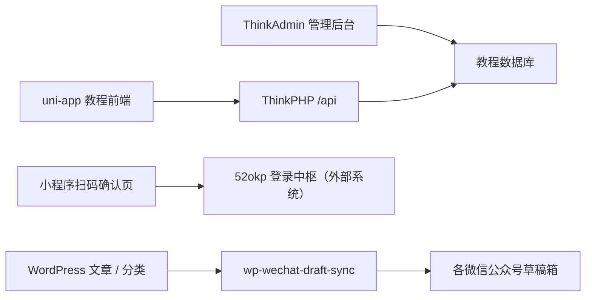

# 项目总结

整理日期：2026-10-09  
用途：记录当前代码基线，为教程项目后续重构及 WordPress 插件联动提供依据。

本文依据本地业务源码、配置定义、迁移脚本和现有文档整理。用户已确认 `wp-wechat-draft-sync` 是正常上线使用的 WordPress 插件；本次未访问生产后台、调用生产接口或核对线上版本。以下“已实现”指本地代码具备的能力，“建议”指尚未实施的后续设计。路径均相对项目根目录。

## 1. 项目定位与当前结论

项目主体是一个 AI / Stable Diffusion 教程与资源展示系统：管理端维护文章、分类、首页头图和资料链接；uni-app 前端展示内容，提供会员资料、收藏和浏览历史。此外，前端承担 52okp 统一账号的微信扫码确认入口。

项目中同时保存了独立部署的“52okp微信发布工具箱”WordPress 插件。它负责将 WordPress 已发布文章排版、上传图片并同步到一个或多个微信公众号的草稿箱。

**当前教程系统与 WordPress 插件尚未直接打通。** 教程文章保存在 ThinkPHP 的 `article` 表，插件读取 WordPress 的文章和分类。当前业务代码没有两端文章映射、同步接收接口或状态回传链路；扫码登录中枢也不是该插件提供的功能。

后续重构需要同时保护三个边界：

- 教程业务：文章、资料、会员、收藏、历史及现有小程序页面路径。
- 统一账号：独立的扫码确认协议，不能把教程会员直接视作中枢账号。
- 公众号发布：保留线上插件的分类路由、账号标识、草稿映射和排版行为。

## 2. 目录与技术组成

| 目录 / 文件 | 当前职责 |
| --- | --- |
| `backend/` | ThinkPHP + ThinkAdmin 后端，包含管理后台、业务 API、模型、数据库迁移与网页安装器 |
| `frontend/` | Vue 3 + uni-app + Vite 前端，当前业务主要围绕微信小程序 |
| `wp-wechat-draft-sync/` | 独立 WordPress 插件，版本 1.3.1，用户已确认上线使用 |
| `legacy-miniprogram/` | 最早的原生微信小程序静态 Demo，作为历史参考保留 |
| `README.md` | 早期项目介绍，页面和接口清单已经落后于当前代码 |
| `DEPLOY.md` | 宝塔部署教程后端的说明，不覆盖 WordPress 插件和登录中枢全链路 |
| `frontend/ACCOUNT-LOGIN-SETUP.md` | 扫码确认入口、中枢配置与真机验收说明 |

本地已有 `backend/vendor/`、`frontend/node_modules/`、`frontend/dist/`、后端运行缓存和 SQLite 文件。它们分别属于依赖、构建产物或运行数据，不应与业务源码混为一谈。`frontend/.account-login-backup-20261003/` 是登录接入时保留的文件备份。

版本依据：

- 后端 `composer.lock`：ThinkPHP `v8.1.4`、ThinkORM `v3.0.34`、ThinkLibrary `v6.1.96`、ThinkAdmin 管理插件 `v1.0.78`、Parsedown `1.8.0`。
- 虽然根 `composer.json` 的 PHP 声明较宽，锁定依赖中的 `symfony/process v7.4.13` 要求 PHP ≥ 8.2，安装器也检查 PHP ≥ 8.2。
- 前端 `package.json`：Vue `^3.4.21`、Vite `5.2.8`、uni-app 系列 `3.0.0-5000720260410001`。
- WordPress 插件自身声明 WordPress ≥ 5.8、PHP ≥ 7.4；它与教程后端的 PHP 环境要求应分别管理。

## 3. 当前系统关系



图中的三条业务链路目前独立。WordPress 站点完整源码、登录中枢服务端代码及其他业务站代码不在本项目中，因此不能仅凭此目录判断它们的全部行为或生产配置。

## 4. 前端业务与页面

### 4.1 页面结构

`frontend/src/pages.json` 注册了 10 个页面，底部 Tab 为首页、分类、我的。

| 页面路径 | 当前功能 |
| --- | --- |
| `pages/home/home` | 首页头图、分类入口、推荐文章、搜索、分享与下拉刷新 |
| `pages/category/category` | 分类切换与分类文章列表，当前每次最多取 50 条，无继续分页入口 |
| `pages/my/my` | 教程会员信息、选择并上传头像、修改昵称、收藏/历史/关于入口 |
| `pages/list/list` | 关键词与分类筛选，按页加载，每页默认 10 条 |
| `pages/detail/detail` | HTML 正文、资料复制、解压密码、收藏、文章分享 |
| `pages/favorites/favorites` | 当前教程会员的收藏列表 |
| `pages/history/history` | 当前教程会员的浏览历史 |
| `pages/about/about` | 后台配置的关注图片、说明和隐私内容 |
| `pages/account-confirm/index` | 52okp 登录或绑定申请的扫码确认、取消与过期处理 |
| `pages/account-policy/index` | 统一账号使用说明 |

首页仍接收 `banners` 数组，但页面仅使用第一张作为首页头图；后台保留多条记录和排序能力。

详情使用 `rich-text` 渲染 HTML，资料区复制 `url`，有提取码时一并复制。分享路径携带教程文章 ID；分享图片对协议相对地址进行补全，对 URL 后缀为 WebP 的图片回退至本地图。

### 4.2 教程 API 客户端

核心文件：`frontend/src/common/api.js`。

- 当前写定教程 API 基址为 `https://ai.600868.xyz`，这是代码配置，不代表本次已验证该站点。
- 本地存储键为 `member_token`；普通业务请求通过 `Member-Token` 请求头发送。
- 响应按业务字段 `code` 判断：1 成功、0 失败、401 需要登录；成功时向页面返回 `data`。
- `memberLogin()` 调用 `uni.login` 获取微信临时 code，提交教程后端，再保存返回 token。
- `App.vue` 普通冷启动在没有 token 时触发静默登录；从扫码确认页或账号说明页冷启动则跳过。
- 收藏、收藏列表、历史列表等部分页面遇到 401 会尝试重新登录；目前没有统一的全局登录恢复机制。
- 当前没有独立的全局状态管理层，页面数据主要由各 Vue 页面自身维护。

### 4.3 52okp 扫码确认协议

核心文件：`frontend/src/common/account-login.js`、`pages/account-confirm/index.vue`。

| 项目 | 当前约定 |
| --- | --- |
| 固定基址 | `https://open.52okp.com/realms/52okp/wechat` |
| 票据入口 | `scene` 优先，否则读取 `ticket`；URL 解码后必须为 32 位小写十六进制字符串 |
| 查询 | `GET /request/{ticket}` |
| 查询字段 | `platform`、`intent`、`state`、`expiresAt` |
| 意图 | `LOGIN` 或 `LINK` |
| 服务端状态 | `WAITING / CONFIRMED / CANCELLED / CONSUMED / EXPIRED` |
| 期限单位 | 页面用 `Date.now()` 计算，约定为毫秒时间戳 |
| 提交 | `POST /confirm`，请求体为 `{ticket, code, decision, accepted}` |
| 操作 | `confirm` 或 `cancel`；确认必须显式同意说明 |
| 身份边界 | 不发送教程 token，不发送客户端自报的 OpenID/用户 ID，每次提交获取新的微信 code |

查询不会自动确认；页面有倒计时、防重复提交、离开页面后忽略延迟响应、409/410 终态处理。超时不会伪装成功，也不会自动重发确认。最终登录或绑定结果以原网页为准。

此入口仅在微信小程序环境执行确认链路，H5/App 会显示使用微信扫码的提示。接入文档将外部中枢说明为 Keycloak；本项目没有它的服务端实现。教程会员与统一账号目前没有迁移、绑定或自动合并逻辑。

## 5. 教程后端

### 5.1 分层与管理能力

- `backend/public/index.php` 通过 ThinkAdmin `RuntimeService` 初始化应用。
- `app/admin/controller/` 提供管理后台，依赖 ThinkAdmin 的控制器、表单、列表、权限和操作日志能力。
- `app/api/controller/` 提供前端业务接口；`Base.php` 统一响应与会员鉴权。
- `app/model/` 保存业务模型，`database/migrations/` 定义业务表与后台菜单。
- `config/route.php` 未强制显式路由，当前 API 采用应用/控制器/操作的路径组织。
- `api` 被排除在后台 RBAC 外，会员接口由业务代码自行校验教程 token。

管理端已实现文章增改、上架/下架、软删除、分类、推荐、首页头图、会员状态及小程序设置。文章表单支持富文本、封面裁剪上传、多网盘链接和解压密码。

Markdown 导入由 `admin/Article.php::mdimport()` 处理：支持简单 frontmatter 的 `title/tags/summary/category`，标题可取首个一级标题，摘要可由纯文本生成，Parsedown 转 HTML 后回填表单。它是“解析并填表”，仍需保存文章，不是独立发布任务。上传使用 ThinkAdmin 存储抽象，实际存储后端取决于配置，不能仅凭代码注释认定生产一定使用某家云存储。

### 5.2 API 清单

以下方法是前端当前调用方式，不代表全部路由均已设置严格的 HTTP 方法限制。

| 方法与路径 | 主要输入 / 输出及行为 |
| --- | --- |
| GET `/api/home/index` | 返回 `banners/categories/recommend`，推荐最多 10 条 |
| GET `/api/category/list` | 返回启用且未删除分类的 `id/name/icon` |
| GET `/api/article/list` | 支持 `page/limit/keyword/tag/category_id/recommend`；返回 `list/total/page/limit` |
| GET `/api/article/detail?id=` | 返回文章、`links/tagList/favorited`；增加阅读量，登录时记录历史 |
| GET `/api/setting/index` | 返回 `follow_image/follow_text/privacy_content` |
| POST `/api/member/login` | code 换微信身份，创建或更新教程会员，返回 `token/member` |
| GET `/api/member/info` | 返回当前会员的 `id/nickname/avatar` |
| POST `/api/member/profile` | 修改昵称与头像 URL |
| POST `/api/member/upload` | 上传字段 `file`，限制扩展名及 5 MB 大小，保存头像并返回地址 |
| POST `/api/member/favorite` | 根据 `article_id` 切换收藏状态，返回 `favorited` |
| GET `/api/member/favorites` | 返回当前会员可见文章的收藏列表，当前未分页 |
| GET `/api/member/history` | 返回浏览历史，按最近浏览时间排序，当前未分页 |

公共文章查询过滤 `status=1`、`is_deleted=0`；文章列表按 `sort desc,id desc` 排序，单页上限 50。`keyword` 搜索标题，`tag` 模糊匹配标签字符串。`recommend` 当前只要不是空字符串就筛选推荐文章，并非严格解析布尔值。

统一返回示例：

```json
{"code": 1, "msg": "ok", "data": {}}
```

需要登录时返回体中的 `code` 是 401，当前 `needLogin()` 没有显式设置 HTTP 401。重构请求层时应保留或兼容这一差异。

### 5.3 数据结构与隐含契约

| 数据表 | 主要字段与用途 |
| --- | --- |
| `article` | 标题、封面、标签、摘要、HTML 正文、资料 links、解压密码、分类、推荐、阅读量、排序、状态、软删除、创建时间 |
| `article_category` | 名称、图标、排序、状态、软删除 |
| `banner` | 标题、图片、关联教程文章 ID、排序、状态、软删除 |
| `member` | OpenID、UnionID、昵称、头像、性别、token、状态、登录时间 |
| `member_favorite` | 教程会员 ID、教程文章 ID、收藏时间 |
| `member_history` | 教程会员 ID、教程文章 ID、最近浏览时间 |
| ThinkAdmin 系统表 | 管理员、权限、菜单、配置、日志等基础设施 |

重点兼容点：

1. `article.links` 数据库存 JSON 文本，模型自动编解码为 `[{type,url,code}]` 数组。
2. `unzip_code` 是独立列；详情 API 额外追加 `{type:"解压密码",url:密码,code:""}` 到返回的 links，前端据此显示复制项。同步入库不能把这个派生条目重复写回源 links。
3. 标签存储为字符串，API 派生 `tagList`；创建时间由模型格式化为展示字符串。
4. 教程文章是单个 `category_id`，WordPress 文章可关联多个分类，两者不能直接等同。
5. 收藏、历史、头图和分享链接均依赖现有教程文章 ID；导入 WordPress 内容时必须保持或映射这些关系。
6. 当前 `article` 没有 WordPress 来源 ID、源站标识、源内容版本、同步状态等字段。
7. 现有业务迁移没有为收藏/历史声明会员与文章的组合唯一约束；并发和幂等应在后续同步设计中明确处理。

教程会员后端使用 `WXAPP_APPID/WXAPP_SECRET` 调用微信 `jscode2session`。token 存在会员记录上，每次登录更新，鉴权要求 token 匹配且会员 `status=1`；当前没有独立会话表、token 到期时间或统一账号主体 ID。

## 6. 已上线 WordPress 插件

### 6.1 文件与职责

| 文件 | 职责 |
| --- | --- |
| `wp-wechat-draft-sync.php` | 插件元信息、版本常量、加载核心类并启动 |
| `includes/class-wwds-plugin.php` | 配置、控制台、文章保存钩子、任务排队、分类路由、排版、图片上传、微信 API、状态记录 |
| `assets/admin.js` | 动态增删公众号配置卡片、更新名称 |
| `assets/admin.css` | 发布工具箱控制台样式 |
| `readme.txt` | 环境要求、安装和版本记录 |
| `THIRD-PARTY-NOTICES.txt` | 摸鱼绿排版来源及许可声明 |

当前核心集中在 `WWDS_Plugin` 单例类。插件没有自建业务表，也没有注册自定义 REST 路由或 AJAX 接口。手动同步是 WordPress 后台操作，不是可直接提供给小程序调用的外部 API。

### 6.2 自动同步链路

1. `save_post_post` 钩子在优先级 20 触发。
2. 检查自动同步开关、文章已发布，并排除修订版与自动保存。
3. 清除同一文章尚未执行的旧计划，安排约 5 秒后的 `wwds_sync_post` 单次任务。
4. 只有排队成功才写 `queued`；失败写错误状态与原因。
5. 任务执行时重新读取文章及分类，筛选具备 AppID/AppSecret、且配置分类与文章分类有交集的公众号。
6. 各账号依次生成内容、处理封面，创建或更新草稿；单号异常会记录后继续处理其他账号。
7. 汇总为成功、部分成功或失败，并写入文章元数据。

延迟时读取分类是为了适应 Gutenberg 保存分类的时序。1.3.1 还专门保留了 WP-Cron 内定时发布、AI 发布触发排队的能力。**重构时不能简单增加“Cron 环境直接返回”的逻辑。**

此处 5 秒是任务的计划时间，真正执行仍取决于 WP-Cron 是否运行。

### 6.3 分类路由与手动同步

- 自动同步：仅匹配配置的 WordPress 分类 ID；账号未选分类时不参与自动同步。
- 一篇文章可以匹配多个公众号；分类采用已关联 ID 的交集，没有额外的父子分类递归匹配逻辑。
- 手动“同步到全部公众号 / 重试”：校验当前用户 `edit_post` 权限和文章 nonce，然后发送给全部配置完整的账号，忽略分类限制。
- 同步对象必须是已发布的 `post`，当前不处理其他文章类型和未发布草稿。
- **插件只创建或更新公众号草稿，不执行自动群发。**
- 当前未实现 WordPress 删除/撤回文章时自动删除公众号草稿。

### 6.4 持久化与兼容要求

配置保存在 WordPress option `wwds_settings`：

```text
auto_sync
accounts[]:
  id, name, appid, secret, author, categories[]
```

账号内部 `id` 用于关联草稿，不能因为调整 UI、账号顺序或显示名称而重新生成。AppSecret 输入留空保留旧值，保存后不回显；存储仍是 WordPress option，不能描述为已加密密钥仓库。

| 元数据 / 缓存 | 当前意义 |
| --- | --- |
| `_wwds_account_media_ids` | 账号内部 ID 到该篇文章公众号草稿 media_id 的映射 |
| `_wwds_account_statuses` | 本次处理各账号的名称、结果、消息和时间 |
| `_wwds_status` | 总体状态 |
| `_wwds_message` | 总体说明或错误 |
| `_wwds_synced_at` | 本轮处理结束时间；代码在失败后也会更新，不能直接解释为最近成功时间 |
| `_wwds_media_id` | 旧单账号版本遗留草稿 ID |
| `wwds_token_ + md5(appid)` | WordPress transient 中的公众号 access_token 缓存 |

状态包括 `queued/syncing/success/partial/error/skipped`。多账号状态保存的是本轮结果，不是完整的历史任务日志。

插件兼容旧版单账号配置，读取时构造稳定的 `legacy_...` ID；在符合条件时把旧 media_id 关联到首个账号。后续改造需要覆盖这一兼容分支。

### 6.5 内容、图片与微信接口

- 正文先经过 WordPress `the_content` 过滤，再用 DOM 解析和转换。
- 正文图片上传至微信 `media/uploadimg`，替换为微信返回的 URL；已有 `mmbiz.qpic.cn` 地址会跳过上传。
- 封面优先特色图片，否则取原始正文首张图片；找不到封面会使该账号本次同步失败。
- 封面通过 `material/add_material` 获取永久素材 ID。
- 图片类型依据文件内容检测，对不支持的格式尝试用 WordPress 图像编辑器转成 JPEG；实际转换能力取决于服务器图像组件。
- 正文采用摸鱼绿静态排版，处理标题、强调、引用、列表、代码块、表格和图片；列表替换和代码空白处理属于现有兼容逻辑。
- 作者取公众号默认作者或 WordPress 作者显示名；摘要取 excerpt 或纯文本并截取；原文链接取 WordPress 永久链接。
- 已有 media_id 时调用 `draft/update`，更新 index 0；没有时调用 `draft/add` 并保存返回映射。
- access_token 按 AppID 缓存，按微信返回有效期提前约 300 秒过期。

运行依赖包括 WP-Cron、PHP DOM、WordPress 图像编辑器、微信接口权限和服务器 IP 白名单。当前没有完整的同步任务历史、运行锁、自动退避重试或图片上传缓存，后续大量同步时可增补；不能把“保存草稿 ID”当作对所有并发情形的完整幂等保证。

## 7. 后续重构与插件联动建议（尚未实施）

### 7.1 先确定内容主源

当前存在两套内容管理系统，联动前需要确定哪一方负责最终编辑：

| 方案 | 数据方向 | 适用条件 |
| --- | --- | --- |
| WordPress 为内容主源 | WordPress → 教程后端 → 小程序；原插件继续负责 WordPress → 公众号草稿 | 文章主要在 WordPress 生产，希望一次编辑供多端使用 |
| 教程后台为内容主源 | 教程后台 → WordPress → 原插件 → 公众号草稿 | 希望继续在现有后台编辑，并借用插件的公众号能力 |

此处不预先认定已选择哪一种方案。建议先完成单向链路和来源标识，再评估双向编辑；双向同步必须有冲突规则，不能简单相互覆盖。

如果采用 WordPress 为主源，可在插件旁增加内容导出/事件通知能力，再由教程后端维护小程序所需的数据模型。如果采用教程后台为主源，则需要受鉴权的 WordPress 写入桥接，并通过正常文章写入流程保留插件的发布钩子。

### 7.2 必须定义的数据契约

| 项目 | 需要补齐的约定 |
| --- | --- |
| 文章身份 | 至少包含源站标识、WordPress post_id、教程 article_id；跨站 ID 不能直接复用 |
| 内容版本 | 增加源更新时间或版本/hash，避免旧事件覆盖新内容 |
| 分类 | WordPress 多分类与教程单分类的映射；保留插件按 WordPress 分类路由的规则 |
| 标签与摘要 | WordPress terms/excerpt 到教程 tags/summary 的转换 |
| 正文 | 保存可供多端转换的源内容；公众号排版 HTML 与小程序 rich-text 展示结果分别处理 |
| 媒体 | 特色图片、正文图片、相对 URL、存储域名和格式支持的处理边界 |
| 资料下载 | 明确 links 与 unzip_code 在 WordPress 中的结构化来源；当前插件没有这些专用字段 |
| 发布状态 | 新增、更新、下架、删除如何传播；是否保留远端草稿应独立定义 |
| 同步状态 | 内容入库状态与各公众号草稿状态分开记录，支持错误定位与重试 |
| 鉴权 | 两端服务间身份和权限，不复用前端教程 token 或 WordPress 后台 nonce |
| 去重 | 根据来源文章与事件版本幂等处理，避免重复建文、重复分发或同步循环 |

建议把跨系统联动封装成独立服务/模块，对现有插件采取增量接入，继续复用现有草稿发布能力。新接口名称、认证方式和数据库迁移均尚未实现。

### 7.3 需要保留的行为与数据

- 原插件 option、账号内部 ID、旧版配置兼容、每文章每账号 media_id 映射。
- 自动分类路由、空分类不自动同步、手动全部账号同步的不同语义。
- Cron 内发布可入队、延迟读取分类、单账号失败不阻断其他账号。
- 只写草稿、现有封面策略、列表与代码排版、非兼容图片转换。
- 小程序文章深链、分页结构、资料复制、收藏状态与历史记录。
- 教程 token 和中枢确认请求相互隔离；扫码进入不自动代表同意或完成教程会员登录。
- 原始正文和持久化业务数据应保留，迁移需要能够核对映射并回退。
- 保留插件已有的第三方排版来源和许可声明。

## 8. 当前值得在重构中处理的具体事项

这些是源码所体现的限制或待核对项，不代表已验证为生产故障。

| 事项 | 代码现状与影响 |
| --- | --- |
| 接口环境配置 | 两个服务地址写在 JS 中，后续宜统一开发/测试/生产配置管理 |
| H5 跨域 | 前端发送 Member-Token，但 `backend/config/app.php` 的 cors_headers 未列出该字段；H5 跨域部署需验证和补齐 |
| 登录恢复 | token 没有显式到期模型；前端各页面处理 401 不一致，改造时需统一兼容 |
| 分页与并发 | 分类页最多 50 条、收藏与历史均未分页；切换分类没有请求版本校验，快速切换可能出现旧响应覆盖 |
| 数据一致性 | 收藏接口只校验正整数文章 ID，没有先验证目标文章是否存在/可见；收藏和历史的并发唯一性也需明确 |
| 插件重复执行 | 清理待执行 Cron 不等于执行锁，手动同步和自动同步并行时仍需评估重复创建 |
| 故障恢复 | 插件没有自动重试队列；远端草稿失效、token 提前失效等情况当前主要依赖记录错误与手动处理 |
| 文档与实现差异 | 根 README 仍主要描述早期列表/详情/关于三页；插件 readme 的旧后台入口文字也未完全对应 1.3 控制台 |
| 平台覆盖 | 有多平台构建脚本不等于各平台全部业务已验收，会员头像和扫码确认明显依赖微信能力 |

## 9. 配置与部署边界

教程后端：

- 默认数据库连接配置为 SQLite，可由 `DB_TYPE` 切换 MySQL；实际环境以部署配置为准，本次不读取或复述密钥。
- 服务入口目录为 `backend/public`，Nginx 转发规则保存在 `backend/宝塔伪静态.conf`。
- 网页安装器先写 `.env`，随后执行现有 `migrate:run`，并非另一套独立建表 SQL；最终仅检查了 system_user 和 article，仍需业务验收确认其他表和配置。
- 小程序会员登录配置项是 `WXAPP_APPID/WXAPP_SECRET`；当前代码从环境变量读取。
- 网页安装器为初始化用途，不应当作现有生产站的升级入口；现有部署文档要求安装后移除安装器。
- 文件上传使用后台配置的存储服务，运行缓存、数据库和上传数据应分别管理。

前端：

- `npm run dev:h5`：H5 开发；`npm run dev:mp-weixin`：微信小程序开发构建。
- `npm run build:mp-weixin`：微信小程序生产构建，产物位于 `frontend/dist/build/mp-weixin`。
- 当前小程序 AppID 为 `wx4ec45155a93041cc`；登录中枢接入文档使用同一 AppID。
- 代码构建、微信平台上传、体验版、正式发布是不同步骤，本地 dist 存在不能证明已经发布。
- 教程后端和登录中枢各自需要合法请求域名配置；当前开发配置中关闭了域名校验，正式验收需开启核对。

WordPress 插件：

- 单独安装于 WordPress 插件目录，不随教程后端或 uni-app 构建自动部署。
- 公众号 AppID/AppSecret 与教程小程序凭据用途不同，应分别维护。
- 后续任何改造先在测试环境核对存量配置、草稿映射和任务触发，再安排上线。

旧版 Demo：

- `legacy-miniprogram` 直接读取 `data/content.js`，包含教程、详情、工具、关于四页。
- `useRemote/apiBase` 只是预留配置，当前页面没有基于它们切换请求的实现。
- 后续重构以 `frontend` 和 `backend` 为主，Demo 可作交互参考。

## 10. 本次核验结果与后续顺序

本次已完成：

- 阅读四个目录的主要自有业务代码，梳理页面、接口、模型、迁移、安装和插件同步流程；第三方库按依赖与调用边界了解，未逐行审计。
- 运行 `node --test tests/account-login.test.mjs`：17 项通过、0 项失败。
- 对 `backend/app`、`backend/config`、`backend/database/migrations`、`backend/public` 顶层 PHP，以及插件 PHP 共 59 个文件执行 `php -l`：全部通过。
- 本次新增总结文档，不修改业务实现、数据库、插件配置或生产系统。

验证边界：未启动完整业务服务、未重新构建前端、未执行迁移、未实测微信扫码或公众号草稿同步。现有登录测试使用模拟接口，语法检查不等同于完整业务回归。

建议后续按以下顺序推进：

1. 确定内容主源、编辑入口、同步方向和下架/删除规则。
2. 固化现有 API、页面路径与插件元数据，建立少量代表性内容作为回归样本。
3. 新增文章与分类映射、内容版本和同步日志，先实现单篇内容的单向联动。
4. 验证正文、图片、下载资料、旧文章收藏/历史与分享深链的兼容。
5. 覆盖多公众号路由、首次建草稿、后续更新、部分失败、定时发布、并发与重试。
6. 在小批量验证和可回退迁移基础上，逐步扩大同步范围并重构内部模块。

## 11. 后续开发优先阅读入口

- 前端业务请求：`frontend/src/common/api.js`
- 中枢协议与入口隔离：`frontend/src/common/account-login.js`、`frontend/src/App.vue`
- 页面注册：`frontend/src/pages.json`
- 文章详情契约：`frontend/src/pages/detail/detail.vue`、`backend/app/api/controller/Article.php`
- 后台编辑与 Markdown 导入：`backend/app/admin/controller/Article.php`、`backend/app/admin/view/article/form.html`
- 会员与鉴权：`backend/app/api/controller/Member.php`、`backend/app/api/controller/Base.php`
- 数据结构：`backend/app/model/`、`backend/database/migrations/`
- 插件同步核心：`wp-wechat-draft-sync/includes/class-wwds-plugin.php`，重点为 `queue_published_post/eligible_accounts/sync_post/sync_post_to_account/prepare_content`
- 登录回归基线：`frontend/tests/account-login.test.mjs`
