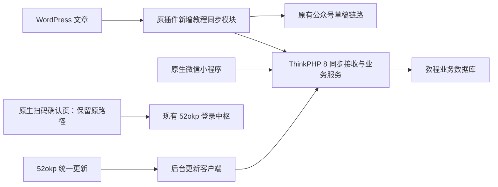

# 项目重构

日期：2026-10-09  
状态：实施交接方案，供 Sol 模型接手开发。  
配套文档：项目根目录《项目总结.md》。本文记录后续目标与约束，已讨论确认的内容优先于旧总结中的备选方案。

## 1. 任务目标

将现有教程项目重构为：

**官方 ThinkPHP 8 后端 + 原生微信小程序 + WordPress 文章同步 + 保持现有统一登录功能 + 接入 52okp 统一在线更新。**

WordPress 是同步文章的内容主源。用户在 WordPress 发布、更新文章后，通过现有插件新增的同步模块写入教程后端，小程序直接展示后端文章。现有公众号草稿同步继续独立工作。

本次交接只生成方案文档，尚未实施重构、注册更新项目或修改生产配置。

## 2. 用户已经确认的硬性要求

| 项目 | 必须遵守的约束 |
| --- | --- |
| 后端框架 | 使用用户指定的官方 ThinkPHP 8 框架，参考 https://doc.thinkphp.cn/v8_0/preface.html |
| 小程序前端 | 从 uni-app 迁移为微信原生小程序架构 |
| 内容来源 | WordPress 文章通过现有插件同步至教程后端，再由小程序展示 |
| 已上线插件 | wp-wechat-draft-sync 已正常上线；增量扩展，不破坏公众号草稿同步 |
| 统一登录 | 现有接口、AppID、页面路径、请求/响应契约、确认行为不变；不要求中枢配合改造 |
| 会员边界 | 教程会员与统一账号保持当前独立关系；不自动绑定、迁移或合并账号 |
| 图片存储 | WordPress 使用 Cloudflare 图床；教程链路只引用图片 URL，不下载到后端本地、不转存、不重新上传 |
| 在线更新 | 接入 https://app.52okp.com 的统一更新系统，提供后台检查、安装、状态与恢复能力 |
| 数据保护 | 保留现有文章 ID、会员、收藏、历史、配置和上传数据，迁移可核对、可恢复 |

特别说明：前期讨论过“新增原生小程序统一账号登录适配接口”，该建议已被用户约束取代，**不得实施**。不得把扫码确认接口改造成教程会员登录接口。

## 3. 当前基线与阅读顺序

当前目录：

- backend：ThinkPHP 8.1.4 + ThinkAdmin，现有管理后台、业务 API 和数据迁移。
- frontend：Vue 3 + uni-app，现有完整业务页面与扫码确认页。
- wp-wechat-draft-sync：版本 1.3.1 的 WordPress 插件。
- legacy-miniprogram：早期原生静态 Demo，仅供参考，不作为完整新版直接使用。

现有后端已经属于 ThinkPHP 8 系列。本次重点是业务结构重构，不是单纯修改框架版本号。依赖小版本根据兼容性锁定，不因官方文档路径含 v8_0 就直接降级现有依赖。PHP 版本按最终 composer.lock 确定，现有依赖基线要求 PHP ≥ 8.2。

接手时优先阅读：

1. 项目总结.md 与本文。
2. frontend/src/common/api.js、account-login.js、App.vue、pages.json。
3. frontend/src/pages/account-confirm/index.vue、account-policy/index.vue。
4. backend/app/api/controller 与 backend/app/model。
5. backend/app/admin/controller/Article.php、对应文章表单、database/migrations。
6. wp-wechat-draft-sync/includes/class-wwds-plugin.php。
7. frontend/tests/account-login.test.mjs。
8. 52okp-private-updates 技能及更新中心实际 /api/spec。

无需反复完整扫描 vendor、node_modules、编译产物或第三方编辑器源码。先沿业务调用链阅读，发现具体依赖问题再深入。

## 4. 目标架构与代码组织



采用单体应用内按业务分层，不引入微服务。建议划分：

| 模块 | 职责 |
| --- | --- |
| Content | 文章、分类、资料、推荐、排序与展示 |
| WordpressSync | 来源站点、鉴权、事件接收、映射、版本控制、同步日志 |
| Member | 现有教程会员、资料、收藏、历史及业务会话 |
| Settings | 首页头图、关于与隐私内容、存储配置 |
| Admin | 管理员认证、权限、后台页面、操作审计 |
| Update | OSS 查询、验包、任务执行、迁移、健康检查与恢复 |

控制器处理 HTTP 与参数；服务层实现业务规则；模型负责持久化；外部请求通过单独客户端封装。为同步和管理操作设置明确路由、HTTP 方法、校验器及权限。

逐步解除业务逻辑对 ThinkAdmin 表单/列表辅助方法的直接依赖。现有后台基础能力可作为迁移参考；更换基础设施时补齐权限、上传、配置和日志，不能只迁移文章接口就宣称整体重构完成。

新后端可先在 backend-next 中开发，原生端可先在 miniprogram-native 中开发。目录名称是建议，正式切换前保留旧版。管理界面第一版优先简单可维护的实现，不把新建复杂前端框架作为前置条件。

## 5. WordPress 文章同步

### 5.1 运行流程

1. WordPress 保存最终文章、分类和元数据后，生成待同步事件。
2. 事件持久化到插件专属队列，后台发送，不在编辑保存请求中等待长时间远程同步。
3. 教程后端验证来源、签名、协议与内容。
4. 根据“来源站点 + WordPress 文章 ID”查找映射。
5. 在事务中执行版本检查、文章新增/更新、分类映射与同步结果记录。
6. 入库成功后返回明确结果，插件记录本次完成；网络失败或临时错误可以重试。
7. 小程序继续从教程 API 获取文章，不直接查询 WordPress。

第一版接收处理以有界的文本校验和数据库事务为主，不在事务里下载图片或访问远程站点。成功响应必须意味着文章变更已提交；如果以后改为异步接收，须区分“已接收”和“已发布”，不能把 202 当发布成功。

### 5.2 插件改造边界

新增独立的教程同步配置、服务类、事件队列与状态视图，避免继续扩大原有单类。

建议提供：

- 后端地址、固定来源站点标识、签名密钥配置。
- 教程同步开关与分类范围，和公众号分类路由分开。
- 自动同步、单篇重试、历史文章批量同步。
- 文章侧栏显示教程后端同步结果，与各公众号草稿结果分开。
- 失败任务列表、错误原因、重试次数与下一次尝试时间。

保留原有 wwds_settings、账号内部 ID、_wwds_* 草稿映射、旧单账号兼容逻辑。新增数据使用独立命名空间，不能覆盖旧状态。

保持原有自动分类路由、手动全部公众号同步、Cron 内发布可排队、图片转换和草稿更新行为。新教程同步失败不能阻断公众号同步。

新增内容捕获可使用 WordPress 保存完成钩子并结合状态、分类、资料元数据变化；需验证 Gutenberg、经典编辑器、定时发布及其他程序发布的时序。防止写同步状态元数据再次触发无限同步。

队列可沿用 WordPress 调度能力，但任务必须持久化并可重试。WP-Cron 依赖触发，不能承诺低流量站点严格几秒内完成；管理界面应能发现积压并手动重试。

### 5.3 发布、编辑和撤回规则

- 仅同步已发布、非私密、非密码保护且在教程同步范围内的文章。
- 首次同步成功后直接进入小程序可展示状态，满足自动发布目标。
- 后续更新修改原映射文章，不重新创建。
- 草稿、私密或密码保护状态不向公开小程序泄露正文。
- 已同步文章转为非公开、移出同步范围、进入回收站或被永久删除时，发送下架事件。
- 永久删除前保存最小撤回事件；后端保留来源版本与墓碑记录，防止延迟旧事件复活文章。
- WordPress 撤回与本地运营隐藏分开存储；后台主动隐藏的文章，不被普通内容更新自动重新上架。
- 教程下架不等于删除公众号草稿；不额外改变原插件公众号删除行为。

WordPress 来源文章的标题、正文等源字段在后台默认只读，可提供“去 WordPress 编辑”入口。推荐、排序、运营隐藏等本地字段继续由后台管理，不被同步覆盖。

原有本地文章可继续维护，明确标记 source_type=local，避免被 WordPress 批量同步误处理。

### 5.4 同步协议建议

以下为待实现的项目协议，不是现有 API。建议单独设置版本，例如 POST /api/sync/v1/wordpress/events。

| 字段 | 用途 |
| --- | --- |
| schema_version | 同步协议版本 |
| site_id | 稳定的来源站点标识，不能因域名变化随意重建 |
| event_id | 事件唯一标识，同一业务事件重试保持不变 |
| post_id | WordPress 文章 ID |
| source_revision | 每篇文章单调递增的持久版本，处理乱序 |
| action | upsert 或 unpublish |
| content_hash | 核对内容一致性，不能单独用哈希判断先后顺序 |
| article | 标题、摘要、正文 HTML、封面 URL、分类、标签、原文地址和资料字段 |

采用独立站点级服务凭据，例如 HTTPS + HMAC-SHA256；签名包含请求方法、路径、时间、nonce 和原始请求体摘要。设置时钟窗口、防重放、密钥轮换和限流。重试使用同一 event_id，但更新请求时间与 nonce。

不得复用教程会员 token、公众号密钥、OIDC client_secret 或 OSS_TOKEN 作为同步凭据。

以数据库唯一约束及事务保证：

- site_id + post_id 唯一映射。
- site_id + event_id 唯一事件。
- 更新时只接受更高 source_revision。
- 重复成功事件返回原结果；较旧事件明确跳过。
- 相同版本但不同内容作为冲突处理，不静默覆盖。
- 下架事件与普通内容更新使用同一版本序列。

历史同步采用分页批次、进度与断点记录，并与增量事件协调。不能因某次列表请求失败或缺少一页，就把未返回文章全部下架。既有教程文章与 WordPress 文章的首次配对要经过可检查的映射，不仅凭相同标题自动合并。

### 5.5 分类与资料

WordPress 支持多分类，旧教程使用单 category_id：

- 保存全部来源分类关系，并记录来源分类 ID 到本地分类 ID 的映射。
- 保留主分类字段供旧接口兼容；主分类由固定优先级规则确定。
- 推荐、排序、首页头图关联属于本地运营数据。
- 下载资料继续使用 links=[{type,url,code}]，解压密码继续使用独立 unzip_code。
- 明确 WordPress 资料字段的来源，不能假定原插件已经存在这些自定义字段。
- payload 未提供资料字段时保留本地资料；提供空数组/空值表示明确清空，二者必须区分。
- 详情 API 将解压密码追加为特殊复制项的行为继续兼容，不能把派生条目重复写回数据库。

## 6. 图片：只使用 Cloudflare 图床链接

这是教程同步链路的硬性限制：

- 封面直接保存 WordPress 输出的 Cloudflare 图片 URL。
- 正文保留图片原始图床链接，原生小程序直接请求图床。
- 后端不下载、不落盘、不重新上传、不建立图片代理缓存。
- 不使用公众号排版完成后的 HTML 作为小程序正文源，避免带入公众号专用图片和样式。
- 相对地址仅在来源明确时补成正确 HTTPS 绝对地址；不猜测或擅自更换域名。
- URL 查询参数可能用于签名或转换，不随意删除。
- 如链接短期过期或受到防盗链限制，调整源站图床访问策略；不偷偷回退成本地下载。
- 根据实际微信 API 用法核对图片访问和域名配置，不为此引入下载转存流程。

后端可做 HTML 安全清理和展示结构规范化，但不得以清理为理由把图片存到本地。过滤脚本、事件属性和危险协议，保留允许的图片地址。

这项限制不改变原插件为公众号上传素材时的现有临时图片处理，也不自动取消用户主动上传头像等既有功能。

## 7. 统一登录：完整保留现有能力

### 7.1 必须原样保留的契约

| 项目 | 现有值 / 行为 |
| --- | --- |
| 小程序 AppID | wx4ec45155a93041cc，继续在同一个小程序发布新版 |
| 确认页 | pages/account-confirm/index |
| 说明页 | pages/account-policy/index |
| 中枢基址 | https://open.52okp.com/realms/52okp/wechat |
| 查询 | GET /request/{ticket} |
| 提交 | POST /confirm |
| 提交字段 | ticket、code、decision、accepted |
| 票据 | scene 优先，否则 ticket；解码后为 32 位小写十六进制 |
| 查询字段 | platform、intent、state、expiresAt；expiresAt 按毫秒时间戳处理 |
| 意图 | LOGIN 或 LINK |
| 状态 | WAITING、CONFIRMED、CANCELLED、CONSUMED、EXPIRED |
| 操作 | confirm 或 cancel；确认必须用户主动同意说明 |
| 凭证 | 每次提交取得新的微信临时 code，不复用教程登录 code |
| 隔离 | 不发送 Member-Token，不发送客户端声称的 OpenID/用户 ID |
| 冷启动 | 从确认页/说明页进入时跳过教程会员静默登录 |

原生迁移只替换实现方式，例如 uni.request → wx.request、uni.login → wx.login、Vue 状态 → 原生页面状态，不改变网络协议。

保留倒计时、防重复点击、取消、409/410 状态处理、页面卸载后忽略延迟响应、超时不伪装成功和不自动重发确认。最终登录/绑定结果仍以发起请求的原网页为准。

用户已有二维码、业务网站和登录中枢不能因重构被迫修改。不要为了分包而改变确认页外部路径，可将它保留为主包内轻量页面。

### 7.2 统一登录与教程会员的边界

现有确认页是中枢扫码流程的专用确认端，不代表它能直接签发教程会员会话。保持教程会员、收藏和历史当前归属；本期不新增统一账号绑定或迁移机制。

公开登录文档面向业务网站，采用 OIDC 授权码 + PKCE。不得把普通业务网站接入与小程序专用确认端混为一谈。也不得依据 realms 路径就假定中枢提供 Keycloak Admin API。

如后续另行增加管理后台的 OIDC 登录，应仅消费现有公开协议，由本地权限系统授予管理员角色；不能让任意统一账号用户自动成为管理员。该扩展不替代本期必须保留的扫码功能，也不是修改中枢的理由。

## 8. 原生微信小程序重构

使用原生 Page/Component、WXML、WXSS、JSON；逻辑代码建议 TypeScript，避免引入另一层跨端运行框架。

迁移现有全部业务：主页、分类、搜索列表、详情、资料复制、我的、头像昵称、收藏、历史、关于、隐私与扫码确认。

优先保留现有页面路径、文章 id 查询参数及分享行为。确需移动普通页面时增加兼容入口；扫码确认和说明页路径不可变。

性能工作以测量为依据：

1. 在旧版记录同一设备、网络、文章数据下的冷启动、首页可见时间、列表滚动和长文章详情表现。
2. 先完成原生首页、列表、详情的纵向样板，再迁移其余页面。
3. 首页聚合请求，避免重复获取数据和不必要的启动登录阻塞。
4. 列表分页与局部 setData，不反复传递整份大列表或完整文章。
5. 对图片采用合适显示尺寸、懒加载及失败占位，继续使用图床地址。
6. 分包与组件按需加载，优先保证主包和外部扫码入口轻量。
7. 原生请求层统一错误提示、业务会话恢复和请求取消/过期响应处理。

不能承诺“改原生就必然快多少”；交付应包含同口径真机对比。原生优先服务微信，H5/App 不在本轮前端交付范围。

## 9. 后端 API 与数据迁移

### 9.1 兼容接口

第一阶段继续兼容现有：

- /api/home/index、/api/category/list。
- /api/article/list、/api/article/detail。
- /api/setting/index。
- /api/member/login、info、profile、upload、favorite、favorites、history。

保持 {code,msg,data}、Member-Token、member_token 存储键、list/total/page/limit、tagList、links、favorited 等现有契约。现有业务 code=401 与 HTTP 状态不是一回事，不能让新请求层误判。

新同步接口采用独立鉴权，不进入普通会员登录流程。后续新版本 API 可并行扩展，旧 uni-app 客户端仍可能留在用户设备中，不能发布新后端后立即删除兼容接口。

### 9.2 数据设计

保留文章、分类、头图、会员、收藏、历史与系统配置。建议新增：

- 来源站点配置与凭据引用。
- 文章来源映射、source_revision、内容摘要、来源状态和本地运营状态。
- 分类映射及多分类关系。
- 同步事件、尝试记录和错误信息。
- 更新任务与迁移版本记录；恢复所需状态同时保存在共享目录。

数据库唯一性与索引要支持来源映射和幂等。对旧收藏/历史增加组合唯一约束前先检查重复数据并制定去重规则，不直接执行可能失败或丢数据的变更。

迁移流程：备份 → 只读盘点 → 演练迁移 → 核对数量/关联/样例内容 → 切换前增量处理或短暂停写 → 正式切换 → 验收。根据实际部署确认 SQLite/MySQL，不能把默认配置当成生产数据库事实。

保留文章、会员主键与关联关系。管理员密码兼容性、存储设置、菜单权限也需核对；不默认创建弱口令管理员代替旧账号。

## 10. 52okp 统一在线更新

### 10.1 已核对的协议

2026-10-09 已只读核对公开文档及 /api/spec，标注 API v1、服务端 v1.4.5。实际开发和发布前再次读取部署中的规范，不用旧技能说明替代线上契约。

公开文档：https://app.52okp.com/api  
原始规范：https://app.52okp.com/api/spec

为本项目注册独立项目标识、真实 GitHub 仓库和项目只读令牌。可暂以 ai-tutorial-backend 作为建议标识，但目前尚未注册，不可写成已存在。不得复用 hao52okp 项目身份或令牌。

业务服务器只访问 OSS；GitHub 来源校验与资产拉取由 OSS 负责。OSS_TOKEN 留在非公开服务器配置，不进小程序、浏览器、URL、日志或更新包。

### 10.2 查询与包格式

遵循现有接口：

```text
GET /api/v1/projects/{project}/updates?current_version=x.y.z&channel=stable
GET /api/v1/projects/{project}/releases/{id}
GET /api/v1/projects/{project}/releases/{id}/manifest
GET /api/v1/projects/{project}/releases/{id}/package
Authorization: Bearer <项目令牌>
```

包文件为 {project}-update.zip；外部清单 update-manifest.json，format=2，必填 product/version/from/package/size/sha256/notes。ZIP 根包含 update-version.json 的 product/version。

版本采用不带 v 的 x.y.z；GitHub 正式 Release tag 为 vX.Y.Z。先生成包内版本文件，再 ZIP，最后生成外部清单。from 是准确起始版本，不匹配时不能强装；需要提供中间版本或经过验证的升级路径。

固定使用同一发布 ID 下载；先验证清单的大小和哈希，再验证 ZIP 的大小和哈希。只允许已配置的 HTTPS origin 和预期路径，不跟随下载重定向。协议不支持 Range，不假定断点续传可用。

401、无发布的 404、历史发布已删除的 404、网络错误要分别说明，不能一律显示“已是最新版”。历史发布被删除后，不得偷偷换另一个版本继续安装。

### 10.3 构建与数据保护

新增可复现构建脚本，输出运行代码、管理界面资源、锁定的生产依赖和迁移脚本。明确随包提供 vendor，或采用经过验证的依赖部署策略；不能指望服务器现有 vendor 恰好兼容，也不在生产运行无约束 composer update。

排除 .env、密钥、服务器专属配置、用户上传、数据库、备份、日志、缓存、队列状态、node_modules、Git 和本机私有文件。

程序默认配置可以随包升级，服务器覆盖配置放共享位置，不能简单排除整个 config 导致新代码缺配置。后台静态资源使用内容指纹，避免更新后混用旧缓存。

按 OSS 当前大小、文件数和解压限额验证产物。新客户端安全校验不能因为 OSS 已验包而省略。

### 10.4 管理体验与后台执行

后台提供“检查更新 → 查看说明与影响 → 安装 → 进度与结果”。

检查更新只查询，不自动安装。管理员点击安装后创建互斥任务，程序自动启动独立后台执行，关闭网页不影响任务。默认不要求用户额外配置宝塔每分钟计划任务、cron 或手动启动常驻执行器。

启动前验证 PHP CLI、扩展、子进程能力、目录权限、磁盘空间和数据库。不得以历史执行器心跳作为安装前置条件。启动失败必须给出具体原因，不能永久停在排队中，也不能静默改为要求用户配置定时任务。

状态至少覆盖下载、校验、备份、安装、迁移、健康检查、完成、恢复和失败。下载百分比依据真实字节数，阶段进度不能冒充精确完成率。

### 10.5 安装与恢复

建议正式部署采用版本目录、当前版本入口与共享数据分离，例如 releases/current/shared 的结构；首次部署时核对宝塔路径、PHP-FPM 与 open_basedir。具体切换实现需按服务器能力验证，不默认放宽目录限制。

- 下载与 staging 放非公开目录。
- 拒绝路径穿越、绝对路径、链接、重复路径、加密项和超限解压。
- 对代码路径采用允许清单，不直接解压覆盖生产根目录。
- 持久化任务日志和恢复状态，避免升级自身代码后丢失执行上下文。
- 必要时暂停业务写入；同步请求返回可重试状态，让插件稍后重发。
- 迁移前完成可验证的数据库备份。
- 优先使用兼容旧代码的增量数据库变更。
- 健康检查核对启动、数据库、文章 API、管理员访问及版本。
- 文件回滚与数据库恢复分开处理；不能只换回文件就宣称数据库已恢复。
- 对进程中断和服务器重启提供明确恢复入口；未验证自动恢复时不能承诺自动恢复。

既有后端没有本项目更新客户端，第一次重构切换需要单独部署与数据迁移。首版建立版本基线和更新能力，后续才通过常规在线更新升级。不要伪造 from=0.0.0 来绕过旧系统迁移。

### 10.6 更新对象分别管理

| 对象 | 本期处理 |
| --- | --- |
| ThinkPHP 后端与管理界面 | 实现统一更新客户端 |
| WordPress 插件 | 单独发布兼容版本；不能由教程服务器更新任务跨服务器覆盖安装 |
| 原生小程序代码 | 微信开发者工具上传、体验版和正式发布；不通过 OSS ZIP 热替换代码 |
| 文章与运营内容 | 通过业务接口更新，无需发布新小程序代码 |

插件如以后接入同一更新中心，应使用独立项目和 WordPress 侧安装客户端，不混入后端包。本期不可把“后台更新成功”展示为插件或小程序也已更新。

## 11. 建议实施阶段与交付条件

| 阶段 | 主要交付 | 完成条件 |
| --- | --- | --- |
| 0 基线 | 代码/数据备份、接口与登录契约、性能记录 | 可确认旧版行为与数据关系 |
| 1 后端基础 | ThinkPHP 8 分层、后台权限、旧 API 兼容、版本与共享数据布局 | 旧 uni-app 能调用新后端核心接口 |
| 2 内容同步 | 插件独立模块、签名、事件、文章/分类映射、批量同步 | 新增/修改/撤回/重试可用，图片零转存，公众号同步不受影响 |
| 3 原生样板 | 首页、列表、详情、请求层 | 真机可阅读同步内容，完成性能对比 |
| 4 功能与登录 | 其余页面、教程会员功能、原生扫码确认 | 既有登录协议不变，全部登录回归通过 |
| 5 在线更新 | 构建器、OSS 客户端、后台任务、备份恢复 | 在隔离环境从基线版本完成一次真实升级及失败恢复 |
| 6 切换 | 数据迁移演练、生产切换方案、运维说明 | 数据核对通过，兼容旧客户端，有明确回退路径 |

阶段 1 就设计更新目录与数据保护边界，不能等代码完成后再补。分阶段交付完整链路，不一次性替换四个目录后才开始联调。

## 12. 必须完成的验收

### 登录

- 相同 AppID、相同扫码路径、相同请求字段。
- 现有网页扫码登录与绑定正常，用户取消不会建立登录结果。
- 错误票据、过期、重复请求、网络失败不会误报成功。
- 确认前不获取并提交授权 code，不跳过同意步骤。
- 确认/取消按原规则获取新 code，确认入口不发送教程 token。
- 冷启动隔离、返回说明页后的倒计时、卸载后忽略延迟响应保持一致。
- 保留现有 17 项测试，新增原生适配测试和真机完整链路验证。

### 内容和图片

- 重复事件不重复建文，乱序事件不回退内容。
- 撤回/删除后不会被迟到事件重新公开。
- 后台运营隐藏不被源内容更新取消。
- 批量导入可续跑，不误下架未成功读取的文章。
- 封面与正文均使用 Cloudflare 链接；同步过程没有图片下载、转存或代理缓存。
- 图床失败显示占位或错误，不偷偷落盘。
- 下载资料、解压密码、分类、推荐和分享路径兼容。
- 原公众号分类路由、手动发送、定时发布和已有草稿更新正常。

### 更新和迁移

- 合法正式包更新成功，用户数据与配置不变。
- 错误项目/令牌、错误哈希、危险 ZIP、错误 from 和不兼容环境被拒绝。
- 双击安装不会创建并发升级。
- 未配置外部定时任务也能启动；关闭网页任务继续。
- 下载失败、后台启动失败、迁移失败和健康检查失败都有真实结果及恢复路径。
- 数据库回滚边界经过验证，不把代码回退等同于数据库恢复。
- 首次迁移后文章/会员 ID、收藏/历史关系与原数据一致。
- 更新前后都回归原生扫码确认链路及旧客户端 API。

## 13. 尚需实施时核对的信息

以下信息不影响先开发模块和模拟测试，但不能自行编造成生产事实：

- 生产数据库类型、PHP/CLI 路径、站点目录、进程权限与备份能力。
- WordPress 实际域名、Cloudflare 图床域名、稳定来源站点标识。
- 开放哪些分类给教程小程序、既有文章首次对应关系。
- WordPress 下载资料的现有字段来源。
- OSS 项目标识、GitHub 仓库和项目令牌是否已注册。
- 实际生产部署与发布安排。

凭据通过服务器环境或非公开配置接入，不要求用户把密钥粘贴到聊天或写入交接文档。

## 14. 给 Sol 的执行提示

本文件是重构实施交接，不是已经完成的功能说明。接手后先核对当前工作区变化，再按阶段推进；不要重复询问本文已确认的登录、图片和原生架构选择。

优先复用已经理解的现有契约，避免无必要的依赖升级、组件堆叠和重复调研。每个阶段提供修改范围、验证结果、遗留问题，明确区分本地实现、隔离联调、上传发布与生产安装。

严禁：

- 改造登录中枢接口或新增替代现有扫码接口。
- 未经独立需求自动合并教程会员与统一账号。
- 下载或转存 WordPress 文章图片到教程后端。
- 重建插件账号 ID、删除既有草稿映射。
- 把数据库文件、密钥、上传数据打入更新包。
- 使用 OSS 更新机制绕过微信小程序发布流程。
- 未实测就宣称上线、登录链路完全兼容或故障恢复已经可用。

公开资料：

- ThinkPHP 8：https://doc.thinkphp.cn/v8_0/preface.html
- 统一登录：https://open.52okp.com/api
- 登录公开协议：https://open.52okp.com/api/spec
- 统一更新：https://app.52okp.com/api
- 更新实际协议：https://app.52okp.com/api/spec

本地更新技能：C:/Users/Administrator/.codex/skills/52okp-private-updates/SKILL.md。使用时阅读 unified-v1.md 与 client.md，按实际协议接入；不照搬其他项目写死的项目名、PHP 版本或密钥。
